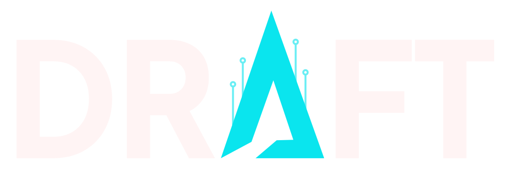

  
  <h1>Draft Creative Studio Ltda</h1>
  
<strong>Audiovisual, Concept Design, Social Media & Investigative Journalism (OSINT)</strong>

  
<em>Founder: Daniel Rodrigues • Global Operations • Brasília / DF</em>

---

## 🚀 Sobre a Empresa

A **Draft Creative Studio Ltda** é uma empresa especializada na convergência entre **narrativa audiovisual cinematográfica**, **concept design estratégico**, **crescimento em redes sociais** e **jornalismo investigativo com inteligência de fontes abertas (OSINT)**.

Fundada por **Daniel Rodrigues** — usuário nativo de Linux desde 2002 na área de TI e com mais de 10 anos de experiência prática no audiovisual e jornalismo — a Draft entrega soluções que unem estética visual de alto padrão e precisão analítica.

---

## 💎 Nossos Serviços Oficiais

1. **Consultoria em Audiovisual & Direção Criativa** (Planejamento estratégico de mídia e posicionamento corporativo)
2. **Produção Audiovisual & Captação Cinematográfica** (Comerciais, filmes institucionais, webseries e documentários)
3. **Edição de Vídeo Sênior & Motion Design** (Ritmo, color grading cinematográfico e sound design)
4. **Concept Design, Branding & Identidade Visual** (Construção de identidades visuais marcantes e manuais corporativos)
5. **Criação de Conteúdo & Social Media** (Reels magnéticos, TikToks e carrosséis de alta retenção)
6. **Fotografia Corporativa & Cobertura de Eventos** (Congressos executivos e retratos de liderança)
7. **Fotojornalismo & Cobertura Institucional** (Registro documental factual e preservação de memória de marcas)
8. **Criação de Roteiros Cinematográficos & Master Scenes** (Storytelling estruturado para cinema e conversão)
9. **Pós-Produção & Motion para Web** (Vídeos otimizados e criativos dinâmicos de tráfego)
10. **Consultoria em Inteligência Artificial para Audiovisual** (Pipelines ágeis com IA generativa)

---

## 🛡️ Investigative Journalism & OSINT

- **Soberania Tecnológica:** Operação em ambientes e servidores Linux nativos desde 2002.
- **OSINT & Forense Digital:** Análise de metadados, verificação de imagens, checagem cruzada e preservação de cadeia de custódia.
- **Automação de Dados:** Programação em Python, scrapers e pipelines investigativos.
- **Rigor Documental:** Apuração factual rigorosa aliada ao olhar crítico e sensibilidade visual.

---

## 🌐 Arquitetura & SEO

- **Padrão Internacional:** Carregamento padrão em Inglês (`en`), com suporte nativo e instantâneo para Português (`pt`), Espanhol (`es`) e Francês (`fr`).
- **Indexação por IA & Motores de Busca:** Schema.org JSON-LD estruturado (`ProfessionalService`, `LocalBusiness`, `Organization`) e sitemap multilíngue com atributos `hreflang`.
- **Contato Direto:** Formulários com envio direto para `draftcs21@gmail.com` e integração com WhatsApp (+55 61 98905-5720).

---

© 2026 Draft Creative Studio Ltda. Todos os direitos reservados.
